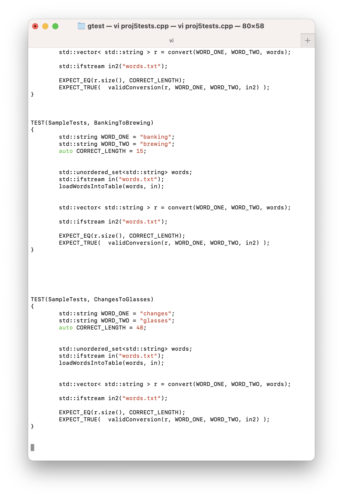
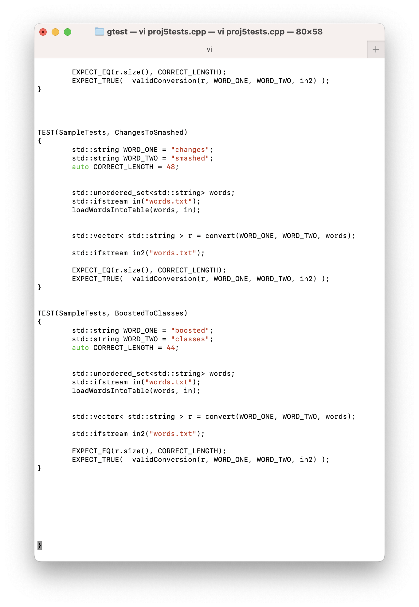
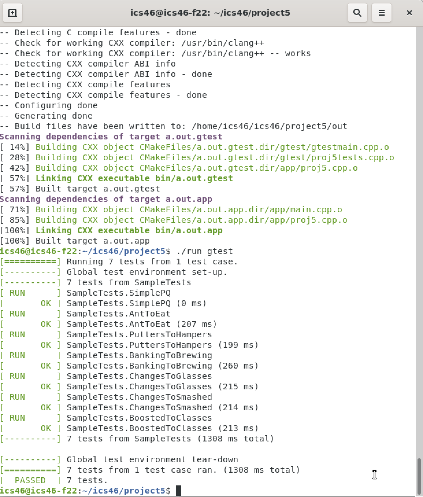

### Desription 

This project creates a priority queue which has the property of a min heap. The insertion will happen at the bottom layer from left to right. The removal will remove the root (the min heap). Both insertion and removal will cause the tree to percolate (if neccessay) to maintain the min heap property. 

After having the priority queue, we will use it to help finding the shortest distance of the Lewis Carroll distance. Instead of using `Breadth First Search` with uninformed searching method, we use `priority queue` to optimize the searching progress because the priority queue's min heap property gives us the shorter distance when searching. 

In addition, in order to have the distance working with `the priority queue`, we need to calculate the distance bettween the first word (s1) with any generated new word and that new word (called a hop) with the final word (s2) (by calculating character differences). The nodes in the priority queue will store these words with the calculated distances. 

### Screen Shots 

